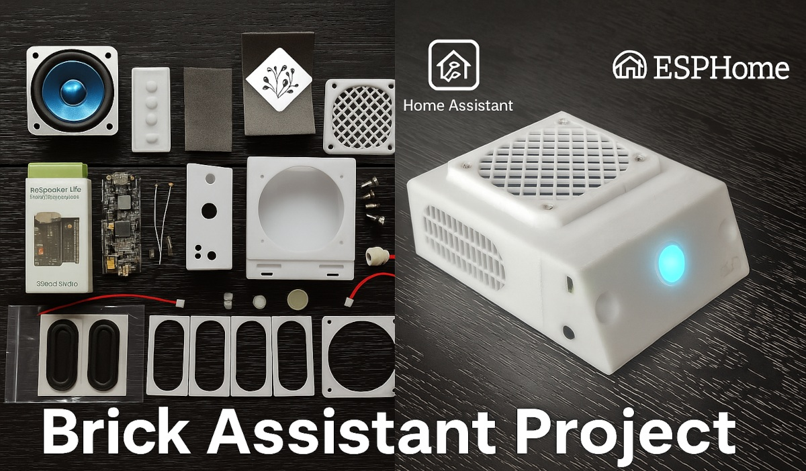

## What is it
# Brick Assistant - DIY Voice Assistant Project
(Fork of [Respeaker-Lite-ESPHome-integration](https://github.com/formatBCE/Respeaker-Lite-ESPHome-integration))
## Check the detailed DIY guide on [diycraic.com](https://diycraic.com/2025/07/28/building-your-own-voice-assistant-for-home-assistant)

## Main Features

- **Based on SeeedStudio ReSpeaker Lite Voice Assistant Kit** ([specifications](https://wiki.seeedstudio.com/xiao_respeaker/))
- **ESPHome firmware** with 16-bit 48kHz audio output for enhanced sound quality
- **Sealed 3D-printed enclosure** with 5W (2" or 2.5") speaker and 2 passive radiators for better sound quality
- **2 multi-functional hardware buttons** for volume, mute, media control, and more
- **Parabolic microphone openings** for improved sensitivity (theoretically)
- **All ports accessible externally,** including 3.5mm line-out for external speakers
- **Additional USB-C power connector** on the back for easy cable management
- **Voice control** for all Home Assistant devices and automation triggers
- **Three selectable wake words:** "Ok Nabu", "Hey Jarvis", "Hey Mycroft"
- **Voice-activated timer** and "Stop" voice command
- **Supports multiple Speech-to-Text and TTS services** in Home Assistant (Whisper, Vosk, etc.)
- **Local speech recognition**—voice data stays local, no cloud required
- **Integration with AI chatbots:** ChatGPT, Gemini, Ollama, DeepSeek, etc. (local or API)
- **RGB LED indicator** available for Home Assistant automations
- **Media playback:** music, radio, voice notifications
- **Siren mode** for security/emergency alerts (CO₂, smoke, water leaks, etc.)
- **Automatic firmware updates** for the XMOS XU316 audio chipset
  

